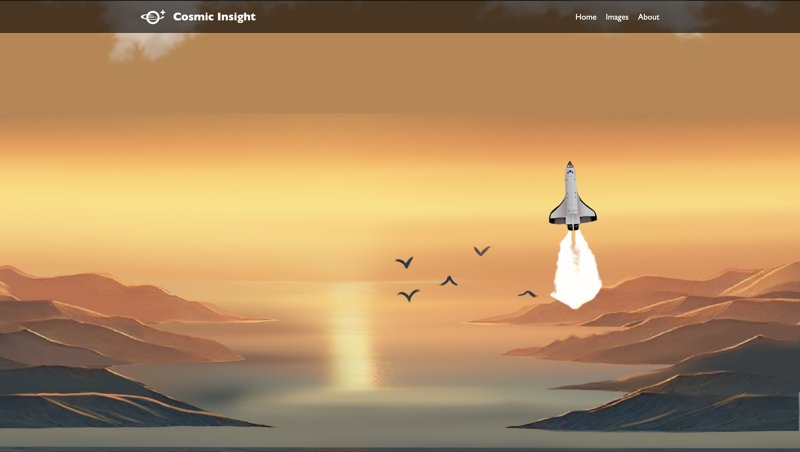
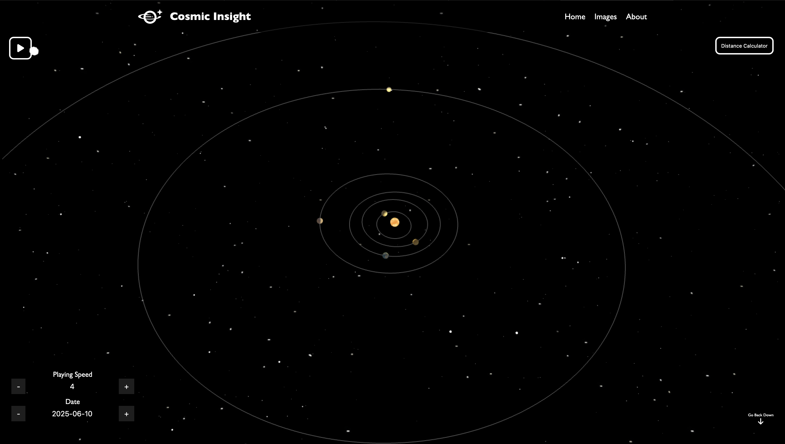
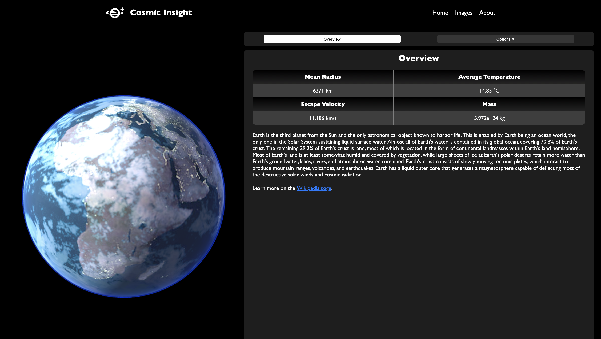
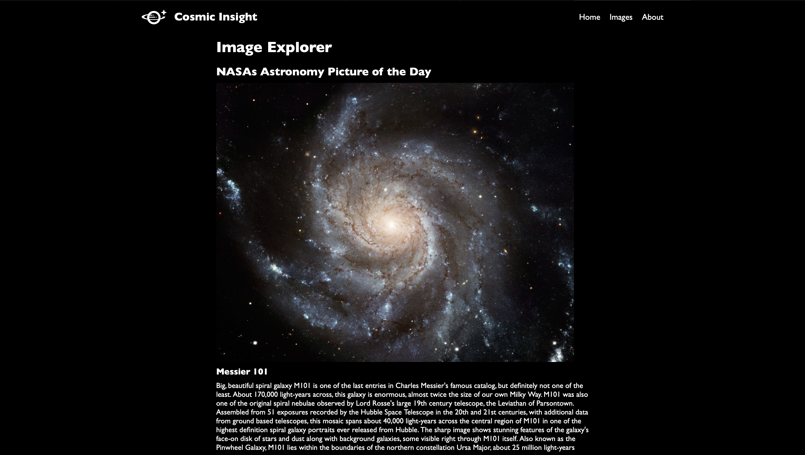

# Cosmic Insight. An exploration of space

Cosmic Insight is an interactive, data-driven platform that invites users to explore the wonders of our solar system. Leveraging data from NASA, Wikipedia and Solar System OpenData, the application provides detailed, visually stunning graphics and transforms complex planetary data into an engaging and accessible experience. It is suitable for teachers and students alike and allows users to get a better understanding of our solar system.

## Features

- A fully interactive solar system view that contains accurate live NASA data for orbits and speeds.
- Planet specific data for all eight planets (and Pluto) provided by Solar System OpenData, NASA and Wikipedia.
- An image library from NASA.

## Users and Accessibility

Cosmic Insight is designed with students in mind, providing an engaging and educational experience that makes learning about the solar system exciting and accessible. The platform incorporates intuitive navigation, visually appealing graphics, and simplified data presentations to ensure that users of all skill levels can explore and understand complex astronomical concepts.

## Developement

The App was developed as a group project as part of "Fundamentals of Web Engineering" course at ETH Zurich.

## Getting Started

1. Clone the repository:

   ```bash
   git clone <link-to-repository>
   ```

2. Move into the cloned folder

   ```bash
      cd <folder-name>
   ```

3. Install dependencies:

   ```bash
   npm i
   ```

   This runs npm install in backend, frontend and the root for you

4. Run the project locally:
   ```bash
   npm run dev
   ```

## Snapshots

The app follows a storyline of a rocket launching into space.

Initially the rocket is on the floor and ready to launch.


When the user starts scrolling the rocket starts taking off.
A parralax effect makes the scene feel more 3 dimensional.

The rocket eventually reaches space where the page transitions into the 3D model of the solar system.

By clicking on a planet the user is taken to an informational page about the planet and presented with various data.

The image explorer allows the user to see NASA's astronomy picture of the day or browse through NASAS database itself by using the search field.


## License

This project is licensed under ETH Zurich.
